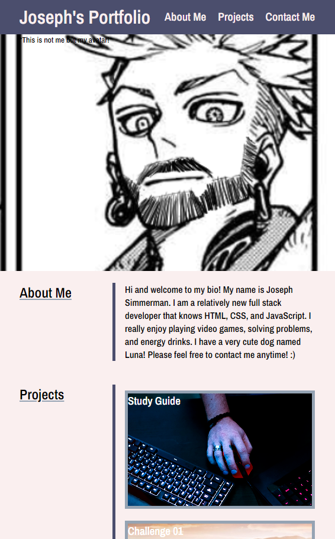
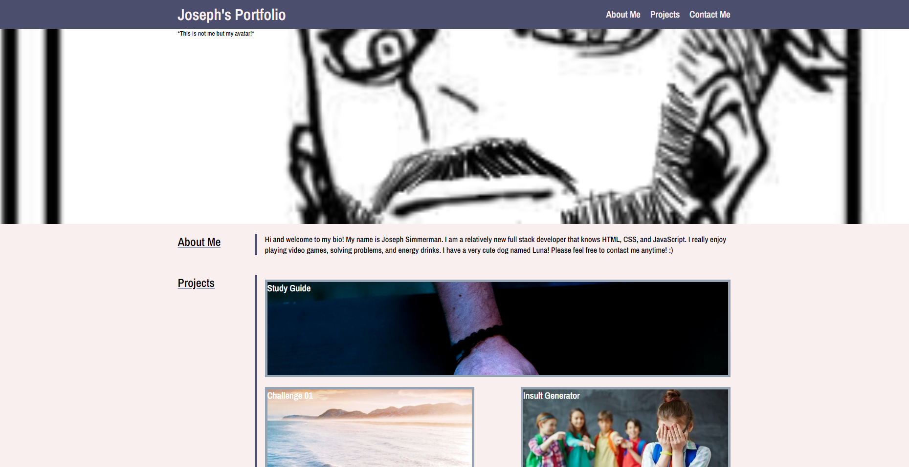

# Joseph's Portfolio

## Description
This website is my current portfolio. It has a navigation bar, a header with my avatar on it, a main body with multiple sections and working links. I have a footer with my copyright. The navbar has a title and multiple links that bring you to the corresponding section. The header has my avatar and a small subtitle explaining that. The main body of the webpage has an "About Me" section, a "Projects" section, and a "Contact Me" section. The "Project" and "Contact Me" sections have multiple links that take you to my projects, my social media, and some surprise places. The entire webpage has been styled and most of it uses flexbox! I added media queries to also add some responsiveness so mobile users are more comfortable on the website!

I wanted to make a site that highlights my projects while also having helpful information about myself that I can send to an employer. I also wanted to test my abilities with CSS and flexbox. 

I learned a lot about flexbox while working on this. I used to try and dictate everything that the flexbox should do instead of just letting it do its thing which caused a LOT of issues and I was able to finally understand how to make something so simple be actually simple instead of over complicating it. I also learned how to import fonts with GoogleAPI.

## Installation
This is N/A as it is a webpage and can be run without installing.

## Usage
This webpage is for being able to access a lot of information about me and my projects. Click the navbar links to go to certain sections. Click the project images and you can go to the projects. Use the information in the contact me section to be able to reach me directly!

Here is a link to the live site: https://fruityokapi.github.io/Joseph-s-Portfolio/

Enjoy!

Here are some screenshots on what the website should look like on mobile and desktop

## Credits
I had a lot of issues with flexbox so I also referenced this video a lot: https://www.youtube.com/watch?v=3YW65K6LcIA

I learned to use GoogleAPI to add fonts using this site: https://developers.google.com/fonts/docs/getting_started

I learned to use stroke but it only works in webkit browsers like Chrome, Safari, and Chromium Browsers. I used one of the styles at this site: https://www.codesdope.com/blog/article/adding-outline-to-text-using-css/

## License
The license is a default MIT license in the LICENSE.md file